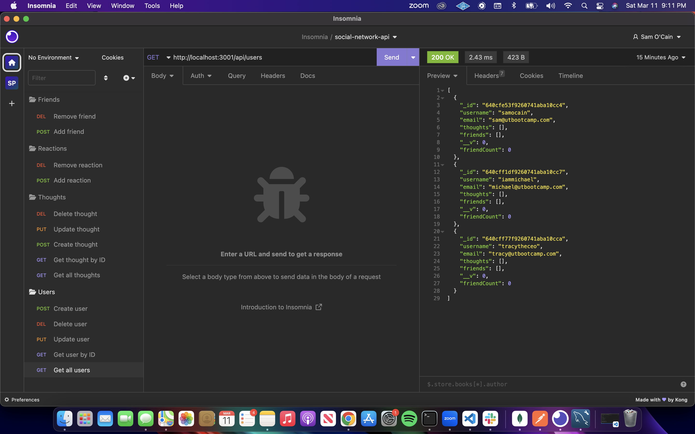
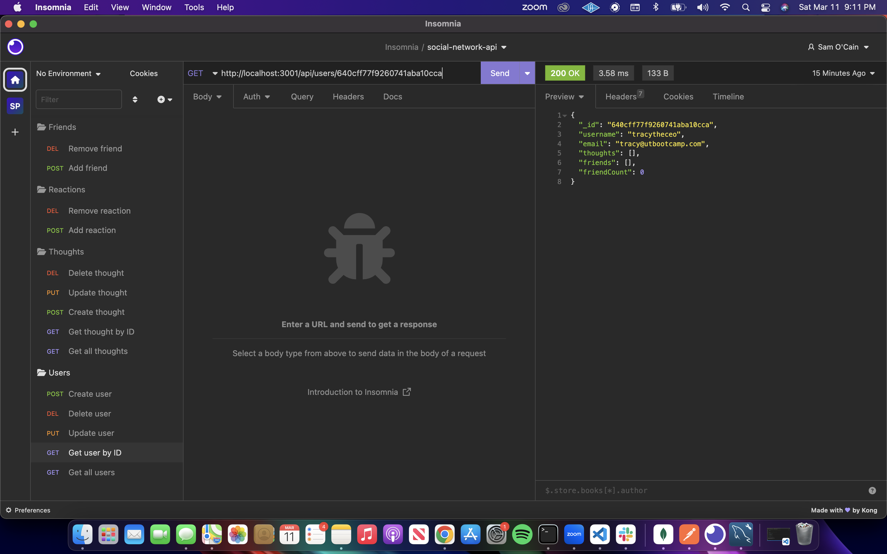
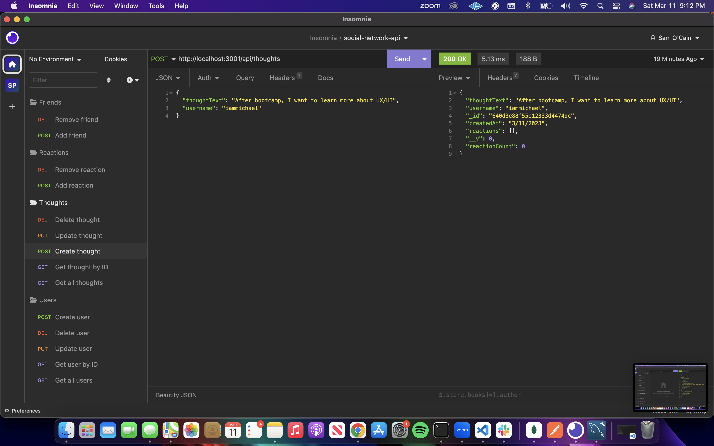
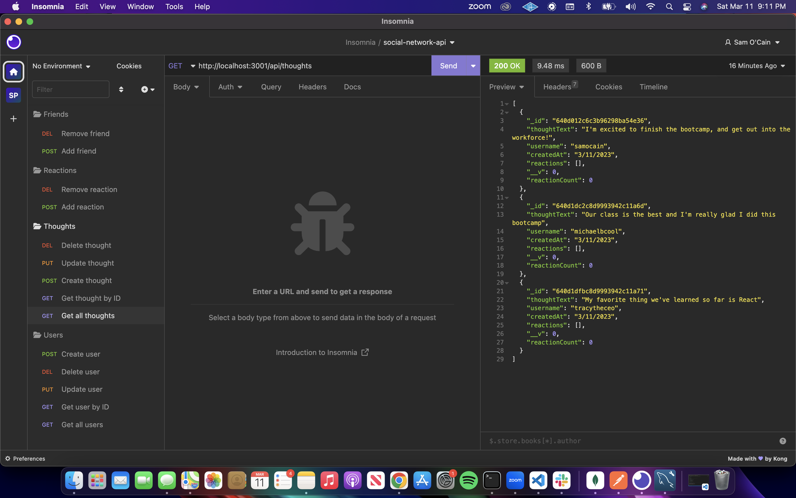
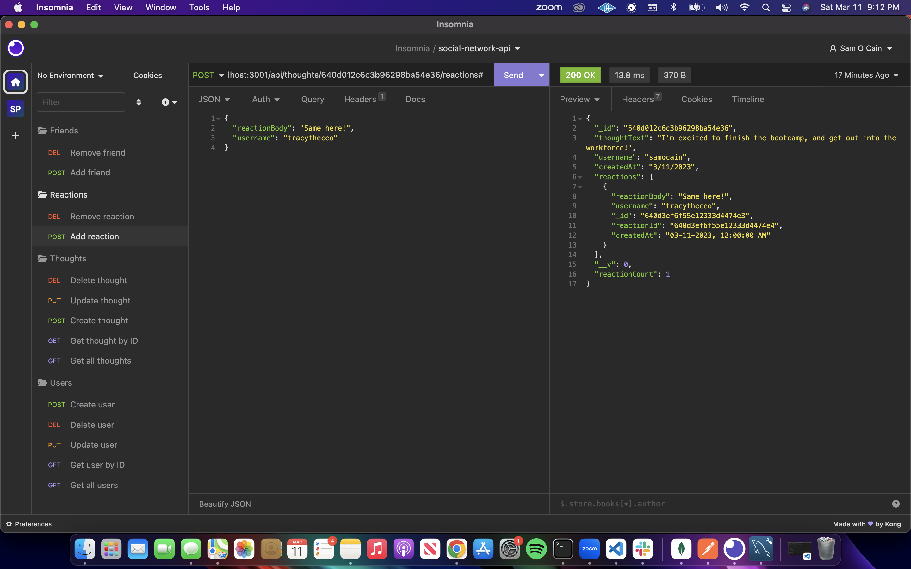

# Social Network API 📱

## Description 📝

This is an API backend for a social network application called "BootCamp Hub" - a network where bootcamp students can share their thoughts, have a friends list, and react to their friends' thoughts all in one place.

The primary goal was to create this API using a NoSQL database - in this case, we used `MongoDB`. This application utilizes `Express.js` for routing, `Mongoose` to handle our database schema and connection, the `Moment.js` module for date formatting, and `Insomnia` for seeding and testing our application and its routes.

### User Story 👨‍💻

- As a social media startup, I want an API for my social network that uses a NoSQL datatbase so that my website can handle large amounts of unstructured data.

## Table of Contents 📚

- [Features](#features)
- [Walkthrough](#walkthrough)
- [Installation](#installation)
- [Usage](#usage)
- [License](#license)
- [Socials](#socials)

## Features 🔨

## Walkthrough 🚶‍♂️

[Click Here to Watch](https://drive.google.com/file/d/12idyc4eQC9DLD874zm6dRKgcP5vx-FLq/view)

## Installation 🔌

- Download or clone this repository to your local machine
- `Node.js` and `MongoDB` will need to be installed in order to use this application
- In the root directory within your integrated terminal, run `npm install` to download the required dependencies

For more information on Node.js and Express, visit:

- https://nodejs.org/en/

- https://expressjs.com/

## Usage 🗺

- Full route functionality can better be seen in the walkthrough video, however, below are some screenshots to demo some of the basic testing done in `Insomnia`

1. Retrieving all users

2. Retriving a single user by ID

3. Create a thought

4. Get all thoughts

5. Add a reaction

## License 📄

## Socials 💬

GitHub: [samocain93](https://github.com/samocain93)
